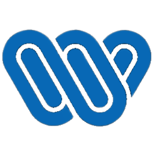
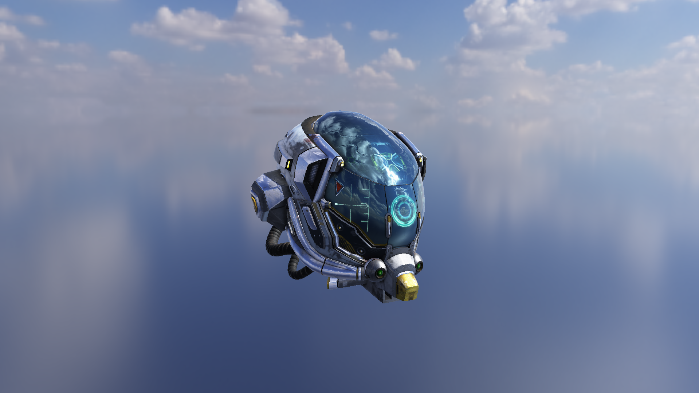
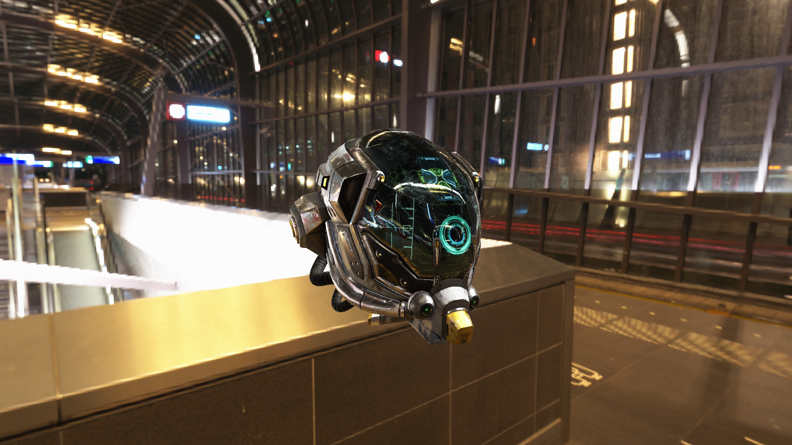
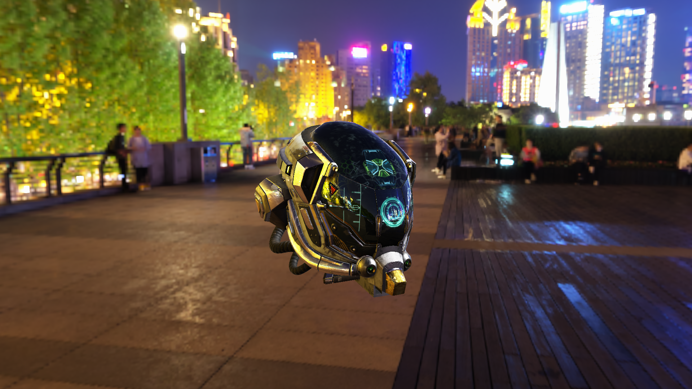
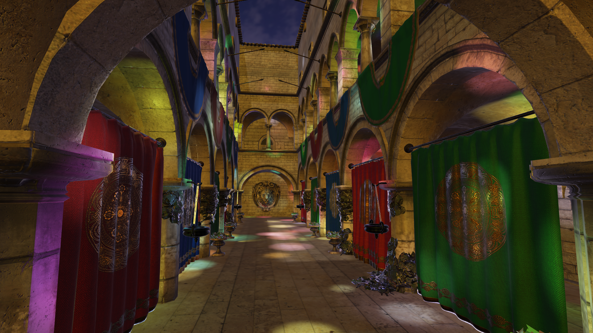
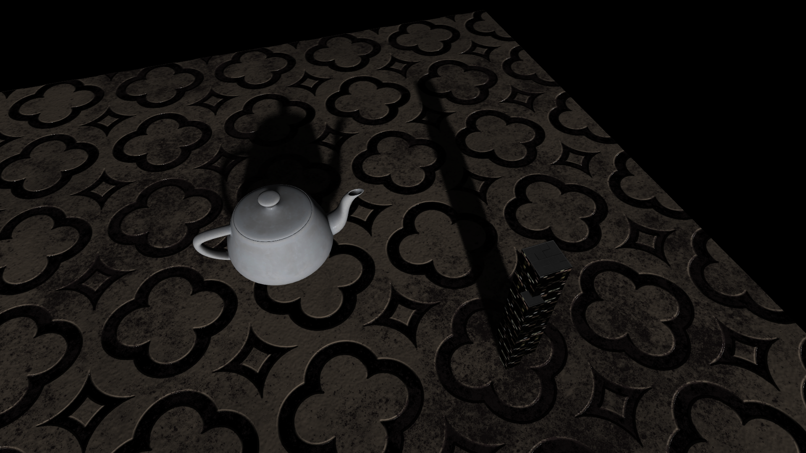

<p align="center">
    
</p>

# Wink Graphics Engine
### A project by descreetStudios, made with love
#### 🔥*Scroll down for cool showcases*🔥

<br>

## What is Wink?

Wink Graphics Engine is a personal project that aims to simplify the vast world of graphics programming by providing an easy-to-use, extensible rendering engine.

The engine features a **Forward Physically Based Renderer** (PBR) with integrated **Image-Based Lighting** (IBL), as well as directional light shadow mapping with **Percentage-Closer Soft Shadows** (PCSS) for realistic soft shadow rendering.

Internally, resources on both the CPU and GPU are managed through a **FreeList Pool** architecture, exposing convenient, strongly typed handles to the user.

A **glTF Model Loader** is included, providing straightforward model loading with support for standard glTF materials.

The repository also includes a Sandbox project that showcases and tests the engine's features. Users can build their own applications by extending the `Application` class and defining the `create_application()` entry point. By overriding the application lifecycle methods, users can leverage the built-in **Entity Component System** (ECS) along with the engine's rendering and resource management features to develop graphics applications.

<br>

## Getting Started

### 1. Clone the repository
```bash
git clone https://github.com/descreetStudios/Wink.git
cd Wink
```
### 2. Configure the project (CMake)
```bash
cmake -S . -B build
```
### 3. Build the engine
```bash
cmake --build build
```
### 4. Run
```bash
./out/build/Sandbox
```

<br> <br>

# Showcases
<p align="center">
    <span style="font-size: 23px;"><b>Damaged Helmet, Clear Sky</b></span>
</p>



<p align="center">
    <span style="font-size: 23px;"><b>Damaged Helmet, Metro</b></span>
</p>



<p align="center">
    <span style="font-size: 23px;"><b>Damaged Helmet, Shanghai</b></span>
</p>



<p align="center">
    <span style="font-size: 23px;"><b>Sponza, Shanghai</b></span>
</p>



<p align="center">
    <span style="font-size: 23px;"><b>Simple Soft Shadows Test</b></span>
</p>

