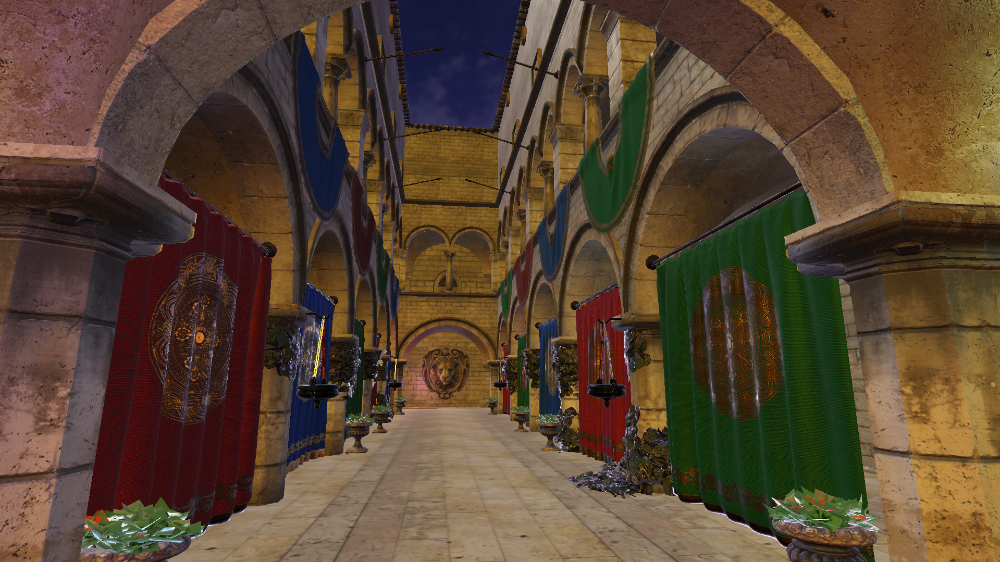

<p align="center">
    
</p>
<p align="center">
    <span style="font-size: 32px;"><b>Wink Graphics Engine</b></span> <br>
    <span style="font-size: 20px;">A project by descreetStudios, made with love</span> <br>
     <br>
    <span style="font-size: 18px;">🔥<i>Scroll down for cool showcases</i>🔥</span> <br>
</p>

# Getting Started

### 1. Clone the repository
```bash
git clone https://github.com/descreetStudios/Wink.git
cd Wink
```
### 2. Configure the project (CMake)
```bash
cmake -S . -B build
```
### 3. Build the engine
```bash
cmake --build build
```
### 4. Run
```bash
./out/build/Sandbox
```

<br> <br>

# Showcases
<p align="center">
    <span style="font-size: 23px;"><b>Damaged Helmet, Clear Sky</b></span>
</p>


<p align="center">
    <span style="font-size: 23px;"><b>Damaged Helmet, Metro</b></span>
</p>


<p align="center">
    <span style="font-size: 23px;"><b>Damaged Helmet, Shanghai</b></span>
</p>


<p align="center">
    <span style="font-size: 23px;"><b>Sponza, Shanghai</b></span>
</p>

